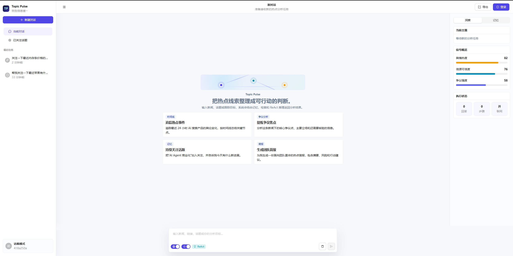
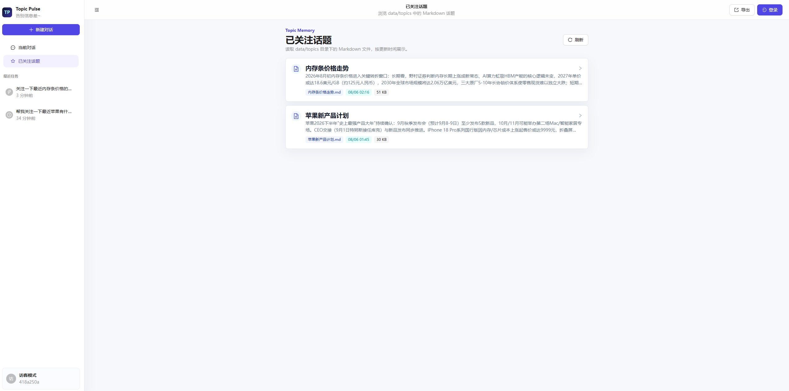
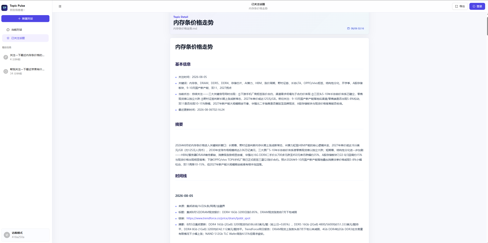
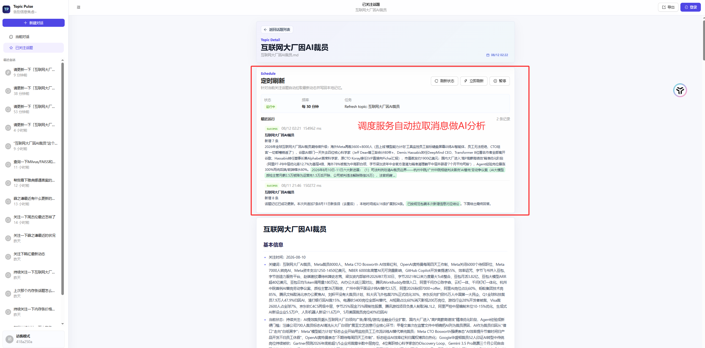
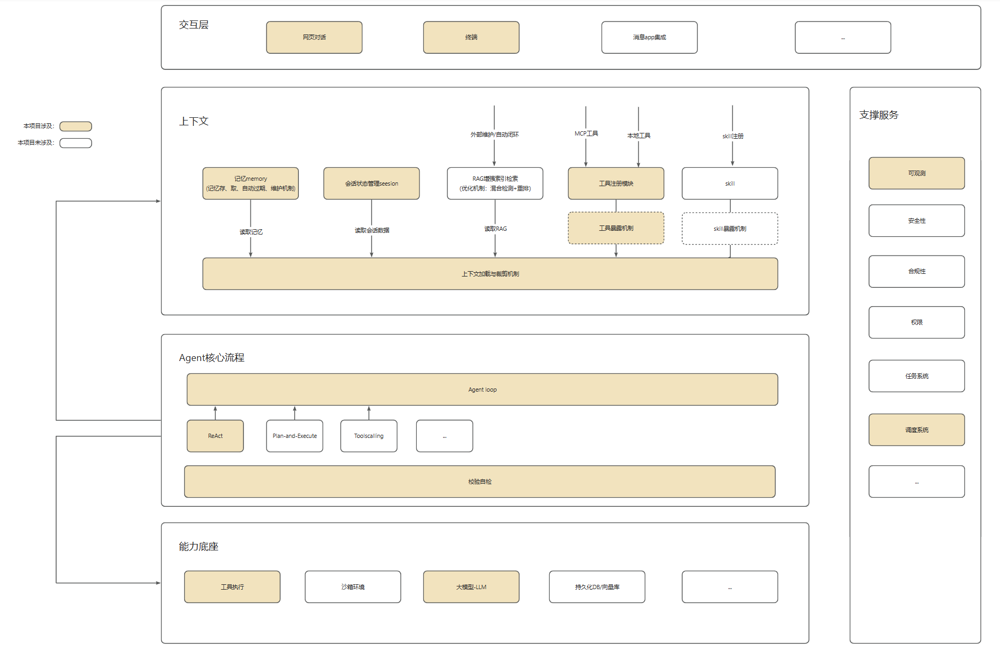

<p align="center">
  <h1 align="center">⚡ Topic Pulse V2</h1>
</p>

<p align="center">
  <strong>面向热点新闻与长期关注话题的 local-first Agent Runtime</strong>
</p>

<p align="center">
  <a href="https://github.com/zhangxiaoxiao9527/topic-pulse-v2/stargazers">
    
  </a>
  
  
  
  
</p>

<p align="center">
  <a href="#quick-start">Quick Start</a>
  ·
  <a href="#architecture">Architecture</a>
  ·
  <a href="#developer-guide">Developer Guide</a>
  ·
  <a href="#project-layout">Project Layout</a>
</p>

Topic Pulse V2 不是一个一次性搜索脚本，也不是一个普通聊天机器人。它是一套围绕“热点信息持续追踪”设计的 Agent 工程骨架：把联网搜索、多轮会话、本地 Markdown 记忆、工具调用、上下文管理和 JSONL 可观测日志组织成一个可扩展、可调试、可测试的运行时。

当用户只是查询一个普通话题时，Agent 会联网检索并直接返回结构化结果；当用户明确表达“持续关注”“长期跟踪”“记录下来”时，Agent 会把搜索结果沉淀为本地 Markdown 话题记忆，并在后续会话中持续合并更新。

## 🖥️ Preview

<p align="center">
  
</p>

<p align="center">
  
</p>

<p align="center">
  
</p>
<p align="center">
  
</p>

## ✨ Highlights

| Capability | What it means |
| --- | --- |
| ReAct Agent Runtime | 支持模型推理、工具选择、工具观察、最终结构化回答的完整闭环。 |
| Local Tool Registry | 本地 Python 工具自动注册，并导出为 LLM 可调用的 tool schema。 |
| Markdown Topic Memory | 将长期关注话题保存为可读、可审计、可手动维护的 Markdown 时间线。 |
| Session-managed History | Web / CLI 不维护历史，由 session 层根据 `session_id` 统一读写多轮对话。 |
| Context Trim Boundary | LLM 调用前统一经过 `context_trim`，为后续裁剪、压缩、摘要预留扩展点。 |
| JSONL Observability | LLM 请求、响应、工具参数、工具结果全部写入 trace 文件，方便复盘。 |

## 🚀 Quick Start

### 1. Install

```powershell
git clone https://github.com/zhangxiaoxiao9527/topic-pulse-v2.git
cd topic-pulse-v2
.\.venv\Scripts\python -m pip install -r requirements.txt
```

If you are not using the checked-in virtual environment, create one first:

```powershell
python -m venv .venv
.\.venv\Scripts\Activate.ps1
pip install -r requirements.txt
```

### 2. Start Backend

```powershell
$env:PYTHONPATH="src"
.\.venv\Scripts\python -m uvicorn topic_pulse_v2_chat.web:app --host 127.0.0.1 --port 8000 --reload
```

Health check:

```text
http://127.0.0.1:8000/api/health
```

### 3. Start Frontend

```powershell
cd src/topic_pulse_v2_chat/web/frontend
npm install
npm run dev
```

Open:

```text
http://127.0.0.1:5173/
```

### 4. Or Use Terminal Chat

```powershell
$env:PYTHONPATH="src"
.\.venv\Scripts\python -m topic_pulse_v2_chat.terminal --user-id user-1
```

Minimal interaction:

```text
你> 查一下内存条最近价格走势
AI> ...

你> 持续关注一下内存条价格走势，看看有没有新变化
AI> ...
```

## 🧭 How It Works

Topic Pulse V2 的核心链路很短，但每一层都有清晰边界：

```text
User Input
  -> Web / Terminal
  -> ReActAgent
  -> Session History
  -> Context Trim
  -> LLM
  -> Tool Registry
  -> Local Tools
  -> Markdown Topic Memory
  -> Structured Answer
```

普通查询路径：

```text
用户提问
  -> 判断需要最新信息
  -> doubao_search
  -> 汇总搜索结果
  -> 返回结构化回答
```

长期关注路径：

```text
用户要求持续关注
  -> topic_markdown_read_summary
  -> doubao_search
  -> topic_markdown_read_detail
  -> topic_markdown_store
  -> 返回更新结果
```

## 🏗️ Architecture

<p align="center">
  
</p>

```text
topic_pulse_v2_chat
  |
  |-- web / terminal
  |
  v
topic_pulse_v2.process.ReActAgent
  |
  |-- llm_call          # model provider abstraction
  |-- tool_register     # local tool discovery and schema export
  |-- tool_call         # tool execution boundary
  |-- session           # state and markdown conversation history
  |-- memory            # lightweight user memory
  |-- context_trim      # context management boundary
  |-- trace.py          # jsonl observability
```

Design principles:

- **Local-first**：长期话题和会话历史优先落在本地 Markdown。
- **Tool-native**：业务能力以工具形式暴露给模型，而不是隐藏在不可见逻辑中。
- **Interface-oriented**：LLM、Session、Memory、Context Trim 均保留替换边界。
- **Observable by default**：每次模型和工具调用都有 JSONL trace。
- **Testable Agent Flow**：工具选择、响应解析、多轮会话、上下文链路都有测试覆盖。

## 🧩 Core Concepts

### ReActAgent

`ReActAgent` 是主流程编排器，负责构建 prompt、调用上下文管理、请求大模型、解析工具调用、执行工具、写 trace、维护 session history，并最终返回 `ReActResult`。

### Local Tools

当前核心工具：

| Tool | Purpose |
| --- | --- |
| `doubao_search` | 联网查询任意话题内容。 |
| `topic_markdown_read_summary` | 读取本地话题摘要，判断是否命中已关注话题。 |
| `topic_markdown_read_detail` | 读取某个 Markdown 话题的完整内容。 |
| `topic_markdown_store` | 创建或更新本地话题 Markdown 记忆。 |

### Markdown Memory

长期话题存储在：

```text
data/topics/
```

会话历史存储在：

```text
src/topic_pulse_v2/session/data/
```

这种设计让 Agent 的“记忆”既能被程序读取，也能被人直接打开审阅。

### Trace Log

默认 trace 文件：

```text
logs/react_trace.jsonl
```

你可以用它观察：

- 发给 LLM 的完整 messages
- LLM 返回的原始 content / tool calls
- 工具调用参数
- 工具响应结果
- context trim 元信息
- Agent 完成状态

## 👤 User Guide

### 普通查询

适合一次性了解某个话题：

```text
查一下内存条最近价格走势
```

Agent 应该联网搜索并直接回答，不写入 Markdown 记忆。

### 长期关注

适合将一个具体新闻话题纳入本地记忆：

```text
持续关注一下内存条价格走势，看看有没有新变化
```

Agent 会读取本地话题、联网搜索最新内容，并创建或更新 Markdown 时间线。

### 继续追问

适合多轮会话：

```text
上次关注的内存条价格怎么样了？
```

历史由 session 层维护，Web 和 CLI 只需要持续传递同一个 `session_id`。

## 🛠️ Developer Guide

### Run Tests

```powershell
$env:PYTHONPATH="src"
.\.venv\Scripts\python -m unittest discover -s tests
```

### Run Focused Agent Tests

```powershell
$env:PYTHONPATH="src"
.\.venv\Scripts\python -m unittest tests.test_react_response_parser tests.test_react_multi_tool_calls tests.test_react_session_history tests.test_context_trim
```

### Build Frontend

```powershell
cd src/topic_pulse_v2_chat/web/frontend
npm run build
```

### Debug With Terminal

```powershell
$env:PYTHONPATH="src"
.\.venv\Scripts\python -m topic_pulse_v2_chat.terminal --user-id debug-user
```

Terminal 模式适合给 `ReActAgent.run()`、工具执行器、搜索工具、Markdown store 打断点。

## 📁 Project Layout

```text
src/topic_pulse_v2/
  context_trim/          # context assembly, trimming and compression boundary
  information_search/    # web search integrations
  llm_call/              # LLM client and provider abstraction
  memory/                # lightweight user memory
  process/               # ReActAgent and business orchestration
  session/               # session state and markdown conversation history
  tool_call/             # tool execution runtime
  tool_register/         # local tool registry and auto-discovery
  trace.py               # jsonl trace logging

src/topic_pulse_v2_chat/
  terminal/              # terminal chat client
  web/                   # FastAPI backend and React frontend

data/topics/             # long-term topic markdown memory
logs/react_trace.jsonl   # runtime trace log
tests/                   # unit and flow tests
test_case/               # functional spec and agent test cases
README/                  # README screenshots and architecture images
```

## 🗺️ Roadmap

- Context trim strategies for long-running sessions
- Better topic matching and alias resolution
- Markdown diff, conflict resolution and provenance tracking
- SQLite / PostgreSQL backed session and topic stores
- Topic graph and timeline visualization in Web UI
- More formal Agent evaluation cases

## ⭐ Star History

<picture>
  <source media="(prefers-color-scheme: dark)" srcset="https://api.star-history.com/svg?repos=zhangxiaoxiao9527/topic-pulse-v2&type=Date&theme=dark">
  <source media="(prefers-color-scheme: light)" srcset="https://api.star-history.com/svg?repos=zhangxiaoxiao9527/topic-pulse-v2&type=Date">
  
</picture>

## 📌 Status

Topic Pulse V2 is under active development. The goal is not to build a universal Agent, but to evolve a precise, observable and durable runtime for turning moving information into local memory.
